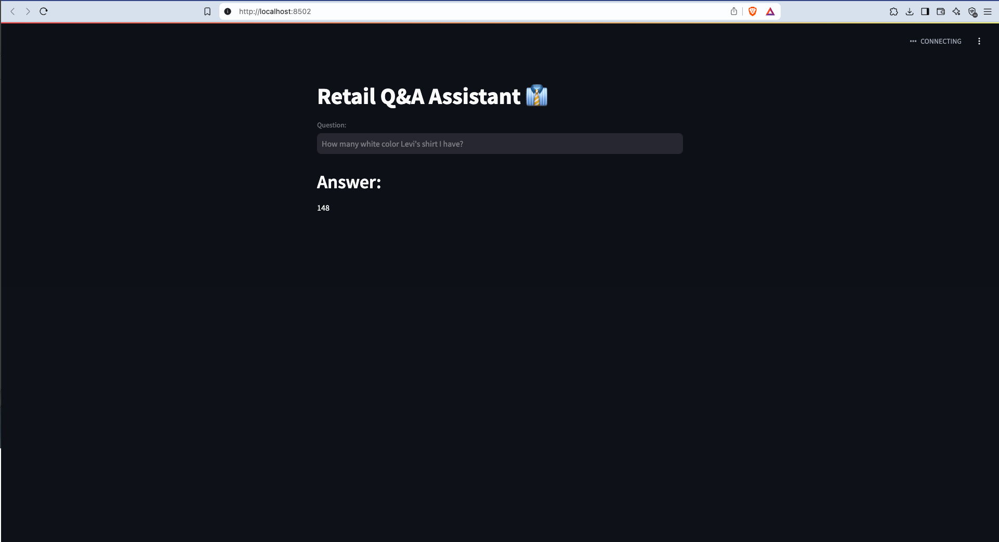

# Retail Q&A Assistant

Created a retail Q&A Assistant which helps the stakeholders to help look into the inventory database and get the answers related to the inventory without any knowledge of writing SQL queries.



## Table of Contents

- [Overview](#overview)
- [Features](#features)
- [Requirements](#requirements)
- [Installation](#installation)
- [Usage](#usage)
- [Project Structure](#project-structure)
- [Contributing](#contributing)
- [License](#license)

---

## Overview


> This project leverages LangChain and other Python libraries to create a RAG model that uses chromaDB as a vector database to store few-shot learning queries. It also uses MySQL database to create the chain. It interacts with MySQL database to answer the questions to stakeholders. It has a nice and simple User Interface created using a Python framework called Streamlit.

---

## Features

- **Few-Shot Learning**: Demonstrates prompt-engineering techniques in `few_shots.py`.
- **LangChain Helpers**: Contains useful functions and classes in `langchain_helper.py` to streamline working with language models.
- **Main Script**: An easy entry point in `main.py` that launches or orchestrates the application logic.
- **Dependency Management**: A `requirements.txt` that consolidates all the libraries you need.

---

## Requirements

This project runs on Python 3.8+ (recommend Python 3.8 or later).  
Below are the main libraries specified in `requirements.txt`:

```
langchain
langchain_openai
langchain-community
langchain_huggingface
langchain_experimental
langgraph
pymysql
cryptography
tf-keras
transformers
Chromadb
streamlit
watchdog
```

---

## Installation

1. **Clone the Repository**  
   ```bash
   git clone https://github.com/sgunpreetsandhu01/Retail-Q-A-Assistant.git
   cd Retail-Q-A-Assistant
   ```

2. **Create and Activate a Virtual Environment** (recommended)  
   ```bash
   python3 -m venv venv
   source venv/bin/activate  # On Windows: venv\Scripts\activate
   ```

3. **Install Dependencies**  
   ```bash
   pip install -r requirements.txt
   ```

---

## Usage

1. **Set Up Environment Variables (if needed)**  
   For example, if you need API keys:
   ```bash
   export OPENAI_API_KEY=your_api_key
   ```

2. **Run the Main Script**  
   ```bash
   streamlit run main.py --server.fileWatcherType none
   ```

3. **Explore Additional Scripts**  
   - `few_shots.py`: Contains examples and demonstrations related to few-shot learning.
   - `langchain_helper.py`: Provides convenient utilities for managing LangChain functionalities.

---

## Project Structure

```
Retail-Q-A-Assistant/
├─ few_shots.py
├─ langchain_helper.py
├─ main.py
├─ requirements.txt
└─ README.md
```

---

## Contributing

1. **Fork** the repository and clone it locally.  
2. Create a **feature branch** (`git checkout -b feature/AmazingFeature`).  
3. Commit your changes (`git commit -m "Add some amazing feature"`).  
4. **Push** to the branch (`git push origin feature/AmazingFeature`).  
5. Open a **Pull Request** on the main repository.  

---

## License

```
MIT License
Copyright (c) [2025] [Gunpreet Singh]
Permission is hereby granted, free of charge, to any person obtaining a copy
...
```

---
